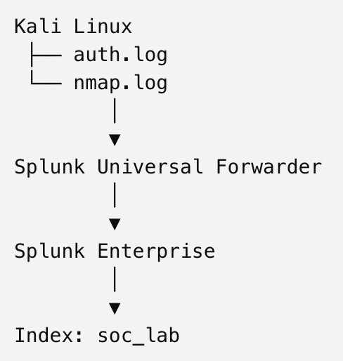

# Mini SOC Lab with Splunk

A hands-on SOC monitoring project built with Splunk Enterprise on macOS and Kali Linux. This lab centralizes authentication, Nmap, and privileged activity logs, then uses SPL to detect SSH brute-force attacks, network scanning, and suspicious sudo activity through a security dashboard.

## Architure

## Detection Rules
| Detection | Description |
|-----------|-------------|
| SSH Brute Force | Multiple failed SSH logins from one IP |
| Network Scanning | Detects TCP port scanning based on firewall logs and multiple destination ports |
| Privileged Activity | Monitoring sudo commands executed as root |

## Dashboard
The Splunk dashboard provides a centralized view of security events, including authentication failures, network scanning activity, and privileged commands.

## Technologies
- Splunk Enterprise
- Splunk Universal Forwarder
- Kali Linux
- SPL (Search Processing Language)
